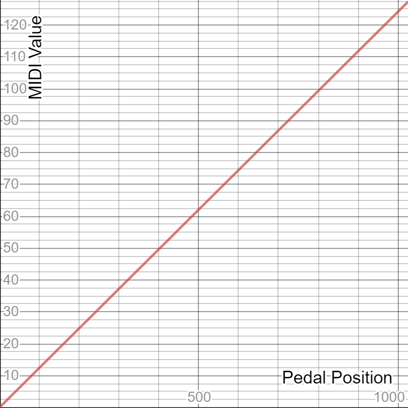
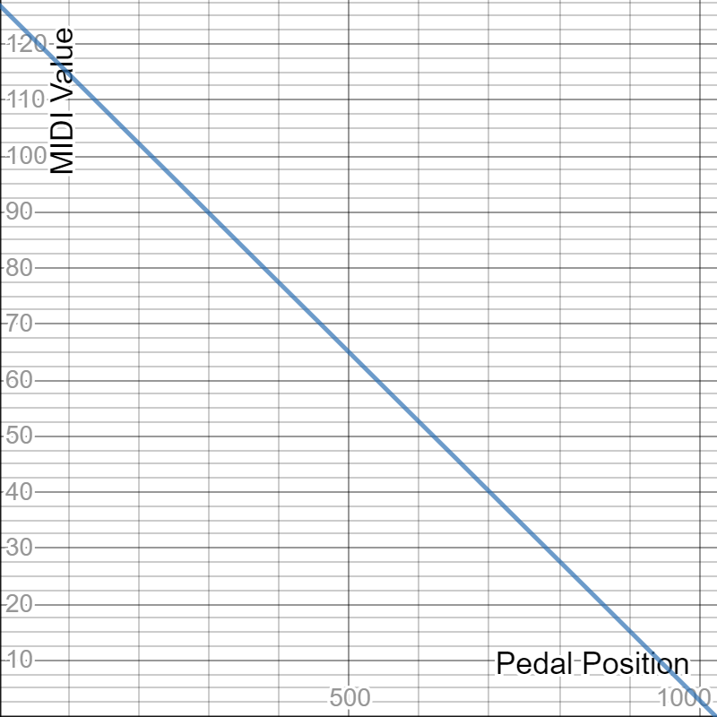
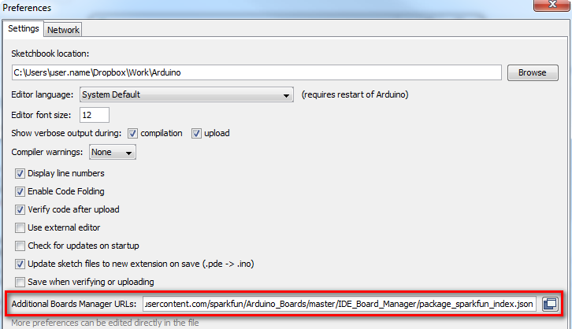
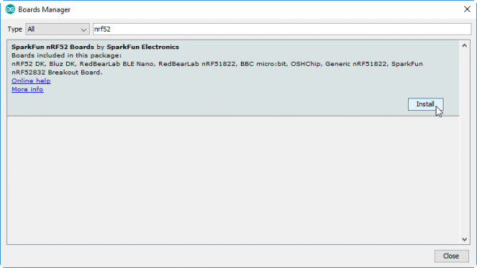
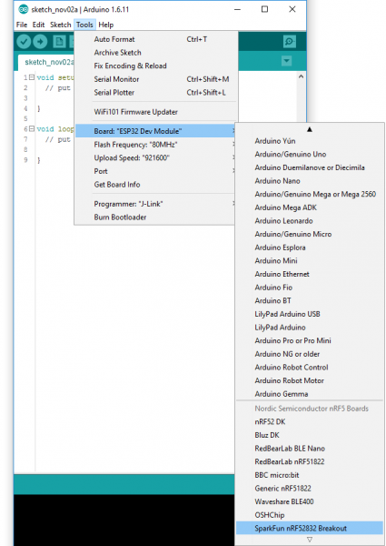
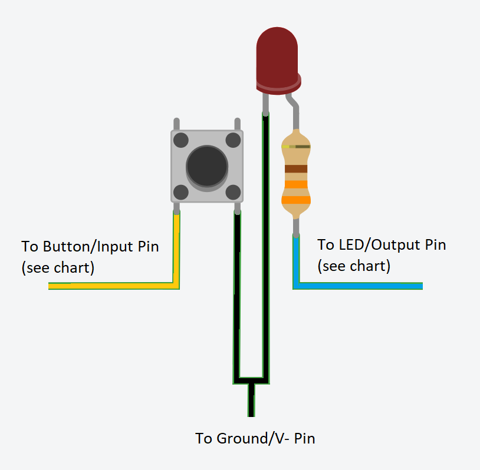

# Wireless Midi BLE Footswitch System

This software will allow you (with the proper hardware) to easily create a
fully wireless Midi BLE pedal/footswitch system.  Out of the box, this
software is configured for four footswitches, and two expression pedals.

WARNING: If you are not going to hook up the expression pedal jacks as
described in this README, then comment out the two addExpressionPedal()
lines in [midi-ble-footswitch.ino](midi-ble-footswitch.ino) or make sure the
device you are using will not uswe the expression pedals as volume.  (or
else you will hear no sound.

Have a look at the demonstration video found here...
[](http://www.youtube.com/watch?v=HWy88jRTAKY)

## Configuring your device

There are two files that need to be modified to customize the software for
how you would like it to behave.

### [config.h](config.h)

Have a look at the configurations found in that file, and adjust as you
see fit.  The defaults do not need to be adjusted unless you are using
different hardware than what is described here.

### [midi-ble-footswitch.ino](midi-ble-footswitch.ino)

This is the main program's entry point, and is where the software is setup
for your preferred hardworad configuration.  Listed below are the defaults,
and possible adjustments you can easily make on your own if customizing.  Again,
if you are following this guide, you can leave everything as it is by default.

The lines that do that magic for you are found in [midi-ble-footwitch/midi-ble-footswitch.ino]

#### Midi Control Change Buttons (default)

These types of buttons send a CC ON when pressed.

```
  controllerObj->addCCButton(13, 12, MIDI_CHANNEL_1, MIDI_CC_CONTROL_20);
  controllerObj->addCCButton(15, 14, MIDI_CHANNEL_1, MIDI_CC_CONTROL_21);
  controllerObj->addCCButton(17, 16, MIDI_CHANNEL_1, MIDI_CC_CONTROL_22);
  controllerObj->addCCButton(19, 18, MIDI_CHANNEL_1, MIDI_CC_CONTROL_23);
```
| Button # | Input Pin | LED Pin | Midi Channel | Midi Control # |
|:--------:|:---------:|:-------:|:------------:|:--------------:|
| 1        | 13        | 12      | 1            | 20             |
| 2        | 15        | 14      | 1            | 21             |
| 3        | 17        | 16      | 1            | 22             |
| 4        | 19        | 18      | 1            | 23             |

* See MidiProtocol.h for MIDI_* constants

#### Midi Control Change / Expression Pedal

This type of control will transmit CC messages with a value of 0-127
depending on the position of the pedal.

```
  controllerObj->addExpressionPedal(2, MIDI_CHANNEL_1, MIDI_CC_CONTROL_12, EXPRESSION_PEDAL_DIRECTION_LOW_TO_HIGH, EXPRESSION_PEDAL_CURVE_LINEAR);
  controllerObj->addExpressionPedal(3, MIDI_CHANNEL_2, MIDI_CC_CONTROL_13, EXPRESSION_PEDAL_DIRECTION_LOW_TO_HIGH, EXPRESSION_PEDAL_CURVE_LINEAR);
```

| Pedal # | Input Pin | Midi Channel | Midi Control # | Direction   | Curve Type |
|:-------:|:---------:|:------------:|:--------------:|:-----------:|:----------:|
| 1       | 2         | 1            | 12             | Low to High | Linear     |
| 2       | 3         | 2            | 13             | Low to High | Linear     |

* See MidiProtocol.h for MIDI_* constants

##### Direction & Curve Types Constants

| Curve Type                         | Direction                              | Curve Shape                                          |
|:-----------------------------------|:--------------------------------------|:------------------------------------------------------|
| EXPRESSION_PEDAL_CURVE_LINEAR      | EXPRESSION_PEDAL_DIRECTION_LOW_TO_HIGH |        |
| EXPRESSION_PEDAL_CURVE_ACCELERATED | EXPRESSION_PEDAL_DIRECTION_LOW_TO_HIGH |   |
| EXPRESSION_PEDAL_CURVE_DECELERATED | EXPRESSION_PEDAL_DIRECTION_LOW_TO_HIGH |   |
| EXPRESSION_PEDAL_CURVE_LINEAR      | EXPRESSION_PEDAL_DIRECTION_HIGH_TO_LOW |       |
| EXPRESSION_PEDAL_CURVE_ACCELERATED | EXPRESSION_PEDAL_DIRECTION_HIGH_TO_LOW |  |
| EXPRESSION_PEDAL_CURVE_DECELERATED | EXPRESSION_PEDAL_DIRECTION_HIGH_TO_LOW |  |

#### Midi Note Buttons (non-default/optional)

These types of buttons send basic NOTE ON/OFF commands when pressed.  If
the button is setup as momentary, then  it will send a NOTE ON when the
button is pressed down, and a NOTE OFF when it is released.  If the
button is setup as a latching type, then it will send alternating NOTE ON
and NOTE OFF messages with each press.

```
  controllerObj->addNoteButton(19, 18, MIDI_CHANNEL_1, MIDI_NOTE_E3, BUTTON_PRESS_TYPE_MOMENTARY);
  controllerObj->addNoteButton(19, 18, MIDI_CHANNEL_1, MIDI_NOTE_F3, BUTTON_PRESS_TYPE_MOMENTARY);
  controllerObj->addNoteButton(19, 18, MIDI_CHANNEL_1, MIDI_NOTE_Gb3, BUTTON_PRESS_TYPE_LATCHING);
  controllerObj->addNoteButton(19, 18, MIDI_CHANNEL_1, MIDI_NOTE_G3, BUTTON_PRESS_TYPE_LATCHING);
```

| Button # | Input Pin | LED Pin | Midi Channel | Midi Note | Midi Note # | Type      |
|:--------:|:---------:|:-------:|:------------:|:---------:|:-----------:|:---------:|
| 1        | 13        | 12        | 1            | E3        | 52        | Momentary |
| 2        | 15        | 14        | 1            | F3        | 53        | Momentary |
| 3        | 17        | 16        | 1            | Gb3       | 54        | Latching  |
| 4        | 19        | 18        | 1            | G3        | 55        | Latching  |

* See MidiProtocol.h for MIDI_* constants


## Hardware Requirements

This software was specifically written to work with a sparkfun nRF52832
(bluetooth/ble) breakout board.

## Building Your Own

You can follow these instructions to build your own 4 button / 2 expression
midi footswitch system, or just use them as a guide to get on your way building
your own.  If you come up with any improvements, please consider contributing
to this project on thingiverse, or github.

### Chassis / Case (3D Printed)

You can download the 3D STL files to print from thingiverse [here](https://www.thingiverse.com/thing:4134488).

Any color of filament will do fine for the main top/bottom parts of the case.  For the pushbuttons, you should use some sort of translucent color with a 10% infill so that the LEDs will be able to shile through adequately.

   - 
   - 


### Parts List

Listed here are all of the components and parts you will need to create a
fully working footswitch, along with links to where you can buy the
components.  You can probably find other substitutes, but this is just what
I ended up working with, so I kept it the same so there would be no
surprises for the next person.

#### Footswitch Components

- Microcontroller
  - Sparkfun BLE Breakout Board
    - Model: WRL-13990 (nRF52832)
    - [Avaliable at DigiKey](https://www.digikey.ca/product-detail/en/sparkfun-electronics/WRL-13990/1568-1449-ND/6562783)
  - WARNING: I tried other cheaper all-in-one boards, but they did not allow low-level access to the bluetooth chipset's features, so I opted to use this more expensive sparkfun board.  If you want to try using abother microcontroller with a NRF52832 chip built in, do so at your own risk.  (the software written SHOULD be compatible --- if you figure out how to use one of those cheaper boards, let me know so I can update the instructions here)
- LiPo Battery
  - 800maH (at maximum draw, about 8h, in reality at least double that)
  - 44mm x 24mm x 9mm
  - [Available on Amazon - B01N74TTW6](https://www.amazon.ca/gp/product/B01N74TTW6)
- LiPo Charging Circuit
  - 17mm x 27mm
  - [Available on Amazon - 18650](https://www.amazon.ca/gp/product/B07CCGVJ79)
- Power regulator circuit
  - [Available on Amazon - T64](https://www.amazon.ca/gp/product/B07L3RMJQB)
- LEDs (3mm)
  - 4 white (for each footswitch)
  - 1 red (for power indicator)
  - 1 green (for charging indicator)
  - [Available on Amazon](https://www.amazon.ca/gp/product/B01LYLN77H)
- 5 330ohm Resistors
  - [Available on Amazon](https://www.amazon.ca/dp/product/B07FYJFLL8)
- Pushbutton switch
  - 7mm x 7mm
  - [Available on Amazon](https://www.amazon.ca/gp/product/B06XR8SQG9)
- 4 Tactile switches
  - 6mm x 6mm x 5mm
  - [Avaialble at Adafruit](https://www.adafruit.com/product/367)
  - [Available at Amazon](https://www.amazon.ca/dp/product/B078HL5CC7)
- Optional: 4 small zip-ties for internal wire management
- Optional: Stereo 1/4" jacks (for expression pedal ports)
- Stranded Wire
  - 24 gauge
  - Optional: different colors
  - [Available on Amazon](https://www.amazon.ca/gp/product/B01KQ0D3M0)
  - WARNING: Use solid core wire at your own risk.  I did, and I regretted it every step of the way.
- Recommended: small crimp connectors
  - 2 x 5 conductor connectors (for ever 2 buttons)
  - 1 x 2 conductor connector (for power)
  - 1 x 2-pin Male JST connector (for LiPo)
    - [Available on Amazon](https://www.amazon.ca/dp/B07C4Y3ZFM)
  - 1 x 4 conductor connector (optional: for every 2 expression pedal ports)

#### Programming Equipment

You will need the following parts to get to the point of being able to
program the Sparkfun BLE Breakout Board.

- Microcontroller Programmer
  - Any USB to TTL Serial Adapter Module will do
  - Make sure it can support supplying 3.3v for programming the sparkfun microcontroller board
  - [Available on Amazon - Gikfun FT232RL 3.3V 5.5V FTDI USB to TTL Serial Adapter](https://www.amazon.ca/gp/product/B01JG8H5U4)
- Header Pin Strip (7 pins worth)
- 6 jumper wires (female-female)

#### Soldering Equipment


Of course you will need the following to piece this thing together.

- Soldering equipment
  - Soldering iron
  - Solder (good quality - for electronics)
  - Solder flux/paste
- Thin (2-3mm?) heat-shrink tubing to keep things neat and tidy


### Instructions

(TODO/WIP --- re-organize this once all the bits are listed hetre)

#### Setting up the Arduino IDE

- Download the Arduino IDE [here](https://www.arduino.cc/en/main/software)
- Open the Arduino IDE
- Add the sparkfun repo
  - CLick File -> Preferences
  - Under "Additional Board Manager URLs", enter
    `https://raw.githubusercontent.com/sparkfun/Arduino_Boards/nrf5/IDE_Board_Manager/package_sparkfun_index.json`
    
  - Click OK
- Install the sparkfun driver
  - Click Tools -> Board -> Boards Manager
  - In the search box, enter `SparkFun nRF52 Boards`.
  - Select that item, and click INSTALL
    
  - BE PATIENT!  This takes a while, and will look like it's not doing
    anything for a while.  It took several minutes for me.
- Select the Sparkfun Board in the IDE
  - Click Tools -> Board
  - Select "SparkFun nRF52832 Breakout" under the "Nordic Semiconductor nRF5 Boards" section.
    
- Clone the software github
  - Drop down to a terminal or command prompt
  - Navigate to where you would like the software to be on your computer.
    (for example c:\\source or ~/source)
  - `git clone git@github.com:danny6869/midi-ble-footswitch.git`
- Open the Folder in the Arduino IDE
  - Open the Arduino IDE
  - Click File -> Open
  - Navigate to the directory/folder where you cloned the project above
  (c:\\source\\midi-ble-footswitch or ~/source/midi-ble-footswitch) and click
  "Open"
  - The code should now be visible in the IDE.
- Test to make sure everything is setup properly
  - In the Arduino IDE, click Sketch -> Verify/Compile (or hit CTRL-R)
  - You should see the bottom black window have a title of "Compiling
    Sketch", and a progress bar on the right.
  - Once that is complete, if everything worked ok, the last lne you should
    see is something similar to the following
    
    `Sketch uses 23628 bytes (5%) of program storage space. Maximum is 409600 bytes.`

  - If you do not see the above line, re-execute all of the steps in this
    section.  (without this, you will not be able to properly program the board)

#### Customizing the Code

- (see "Customizing Your Device" above)

#### Programming the Microcontroller Board

1. Solder a 6 pin header strip onto the 6 debug pins found on the bottom
edge of the sparkfun board

2. If using the Gikfun programming board listed above, solder a 1 pin header
to the terminal labeled 3.3v (as the sparkfun board needs 3.3v while
programming)

3. Use the 6 female-female jumper wires to match up the pins from USB to TTL programmer.  Basically the pin labels should all match, except the TX pin should be linked to the RX pin on the other board, and vice-versa.  Also, beware that the programming voltage of the sparkfun board is 3.3v, so we will not be connecting to the VCC pin on the programming board, but to the 3.3v pin we soldered onto it in the previous step.
   - 

4. Plug the programming board into your computer using a USB cable (mini usb in the case of the Gikfun programming board)
   - (if you are programming a fully assembled unit, be sure to disconnect the LiPo battery)

5. Configure the Programming Board in the Arduino IDE
   - Open the Arduino IDE
   - Click Tools -> Port and select the COM port of the programmer board (most likely the only COM port listed)
   - Click Tools -> Programmer
   - Select "AVRISP mkII"

6. Get the Sparkfun BLE Board in bootloader/programming mode
   - Push, and hold the pin 6 button
   - Push and release the reset button
   - Within a second or two you should see the onboard blue LED light flash a
  sequence of long to short flashes.  If you see this, you are in
  programming mode, and the device is ready to be flashed.
   - If you DO NOT see that LED flashing sequence, there is probably some
  sort of interference, or static happening.  IT TOOK ME FOREVER TO REALIZE
  THAT MY FINGERS WERE CAUSING THE ISSUE.
   - Helpful tips if you are having trouble getting the board into bootloader
  mode
     - Put the board(s) on non-conducting static-free surface, like a table.
     - Use two toothpicks to press the Pin 6/Reset buttons.
     - WARNING: FIGURING OUT THAT THIS WAS THE ISSUE FOR ME WAS THE SINGLE MOST FRUSTRATING PART OF THIS PROJECT.  BE PATIENT, AND FOLLOW THESE TIPS CAREFULLY TO SAVE YOURSELF FRUSTRATION!
   - For more information about getting started with the Sparkfun BLE Board,
  see the [Official Sparkfun BLE Breakout Board Hookup Guide](https://learn.sparkfun.com/tutorials/nrf52832-breakout-board-hookup-guide?_ga=2.235217601.1522060654.1581984917-256708523.1575427305)

7. Flash the Sparkfun Board
   - Open the Arduino IDE
   - Open the midi-ble-footswitch code
   - Click Sketch -> Upload (or CTRL-U)

#### Testing / Debugging

WARNING: Before continuing...If you are testing or debugging a fully assembled footswitch unit, unplug the LiPo battery before following these instructions.

- Connect the programmer to the sparkfun board (using the jumper cables as described above)
- Open the Arduino IDE
- Click Tools -> Serial Monitor
- In the window that pops up, ensure your communication settings in the bottom right corner are set properly for your programmer device (115200, 8, N, 1)
- Connect the programmer to the computer using a USB cable
- Once the unit boots (after a few seconds) you should start seeing debug output from the Sparkfun board.

#### Power Circuit Assembly


#### Button Assembly




## Special Thanks

### [DigiKey](https://www.digikey.ca)

- Website: https://www.digikey.ca
- Thanks to [DigiKey](https://www.digikey.ca) for having a great online store, with
  a huge selection, and more importantly, for saving me a ton of time by providing
  a [great tutorial](https://www.digikey.ca/en/maker/projects/midi-ble-tutorial/6964435cd2854ed1856aeb7b177312c3)
  for doing basic MIDI BLE communication.

### [The Midi Association](https://www.midi.org/)

- Website: https://www.midi.org/
- Thanks to [The Midi Association](https://www.midi.org/) for creating a protocol
that is well documented, and has stood the test of time, and moved into the 21st
century (with the [Bluetooth LE MIDI Specification](https://www.midi.org/specifications/item/bluetooth-le-midi)).

