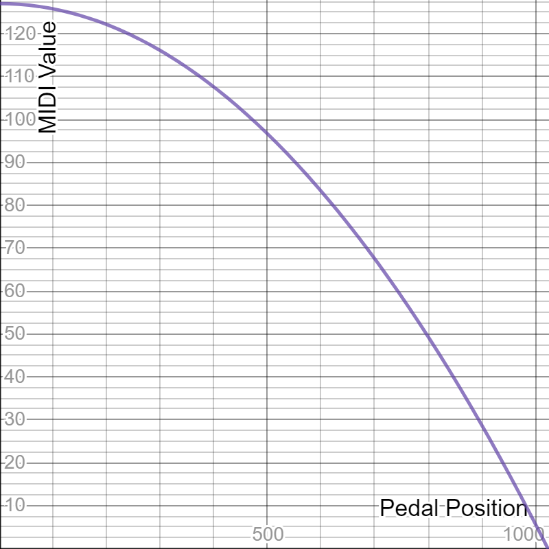

# Wireless Midi BLE Footswitch System

This software will allow you (with the proper hardware) to easily create a
fully wireless Midi BLE pedal/footswitch system.  Out of the box, this
software is configured for four footswitches, and two expression pedals.

WARNING: If you are not going to hook up the expression pedal jacks as
described in this README, then comment out the two addExpressionPedal()
lines in [midi-ble-footswitch.ino](midi-ble-footswitch.ino) or make sure the
device you are using will not uswe the expression pedals as volume.  (or
else you will hear no sound.

Have a look at the demonstration video found here...
[](http://www.youtube.com/watch?v=HWy88jRTAKY)

## Configuring your device

There are two files that need to be modified to customize the software for
how you would like it to behave.

### [config.h](config.h)

Have a look at the configurations found in that file, and adjust as you
see fit.  The defaults do not need to be adjusted unless you are using
different hardware than what is described here.

### [midi-ble-footswitch.ino](midi-ble-footswitch.ino)

This is the main program's entry point, and is where the software is setup
for your preferred hardworad configuration.  Listed below are the defaults,
and possible adjustments you can easily make on your own if customizing.  Again,
if you are following this guide, you can leave everything as it is by default.

The lines that do that magic for you are found in [midi-ble-footwitch/midi-ble-footswitch.ino]

#### Midi Control Change Buttons (default)

These types of buttons send a CC ON when pressed.

```
  controllerObj->addCCButton(13, 12, MIDI_CHANNEL_1, MIDI_CC_CONTROL_20);
  controllerObj->addCCButton(15, 14, MIDI_CHANNEL_1, MIDI_CC_CONTROL_21);
  controllerObj->addCCButton(17, 16, MIDI_CHANNEL_1, MIDI_CC_CONTROL_22);
  controllerObj->addCCButton(19, 18, MIDI_CHANNEL_1, MIDI_CC_CONTROL_23);
```
| Button # | Input Pin | LED Pin | Midi Channel | Midi Control # |
|:--------:|:---------:|:-------:|:------------:|:--------------:|
| 1        | 13        | 12      | 1            | 20             |
| 2        | 15        | 14      | 1            | 21             |
| 3        | 17        | 16      | 1            | 22             |
| 4        | 19        | 18      | 1            | 23             |

* See MidiProtocol.h for MIDI_* constants

#### Midi Control Change / Expression Pedal

This type of control will transmit CC messages with a value of 0-127
depending on the position of the pedal.

```
  controllerObj->addExpressionPedal(2, MIDI_CHANNEL_1, MIDI_CC_CONTROL_12, EXPRESSION_PEDAL_DIRECTION_LOW_TO_HIGH, EXPRESSION_PEDAL_CURVE_LINEAR);
  controllerObj->addExpressionPedal(3, MIDI_CHANNEL_2, MIDI_CC_CONTROL_13, EXPRESSION_PEDAL_DIRECTION_LOW_TO_HIGH, EXPRESSION_PEDAL_CURVE_LINEAR);
```

| Pedal # | Input Pin | Midi Channel | Midi Control # | Direction   | Curve Type |
|:-------:|:---------:|:------------:|:--------------:|:-----------:|:----------:|
| 1       | 2         | 1            | 12             | Low to High | Linear     |
| 2       | 3         | 2            | 13             | Low to High | Linear     |

* See MidiProtocol.h for MIDI_* constants

##### Direction & Curve Types Constants

| Curve Type                         | Direction                              | Curve Shape                                    |
|:-----------------------------------|:--------------------------------------|:------------------------------------------------|
| EXPRESSION_PEDAL_CURVE_LINEAR      | EXPRESSION_PEDAL_DIRECTION_LOW_TO_HIGH |        |
| EXPRESSION_PEDAL_CURVE_ACCELERATED | EXPRESSION_PEDAL_DIRECTION_LOW_TO_HIGH |   |
| EXPRESSION_PEDAL_CURVE_DECELERATED | EXPRESSION_PEDAL_DIRECTION_LOW_TO_HIGH |   |
| EXPRESSION_PEDAL_CURVE_LINEAR      | EXPRESSION_PEDAL_DIRECTION_HIGH_TO_LOW |       |
| EXPRESSION_PEDAL_CURVE_ACCELERATED | EXPRESSION_PEDAL_DIRECTION_HIGH_TO_LOW |  |
| EXPRESSION_PEDAL_CURVE_DECELERATED | EXPRESSION_PEDAL_DIRECTION_HIGH_TO_LOW |   |

#### Midi Note Buttons (non-default/optional)

These types of buttons send basic NOTE ON/OFF commands when pressed.  If
the button is setup as momentary, then  it will send a NOTE ON when the
button is pressed down, and a NOTE OFF when it is released.  If the
button is setup as a latching type, then it will send alternating NOTE ON
and NOTE OFF messages with each press.

```
  controllerObj->addNoteButton(19, 18, MIDI_CHANNEL_1, MIDI_NOTE_E3, BUTTON_PRESS_TYPE_MOMENTARY);
  controllerObj->addNoteButton(19, 18, MIDI_CHANNEL_1, MIDI_NOTE_F3, BUTTON_PRESS_TYPE_MOMENTARY);
  controllerObj->addNoteButton(19, 18, MIDI_CHANNEL_1, MIDI_NOTE_Gb3, BUTTON_PRESS_TYPE_LATCHING);
  controllerObj->addNoteButton(19, 18, MIDI_CHANNEL_1, MIDI_NOTE_G3, BUTTON_PRESS_TYPE_LATCHING);
```

| Button # | Input Pin | LED Pin | Midi Channel | Midi Note | Midi Note # | Type      |
|:--------:|:---------:|:-------:|:------------:|:---------:|:-----------:|:---------:|
| 1        | 13        | 12        | 1            | E3        | 52        | Momentary |
| 2        | 15        | 14        | 1            | F3        | 53        | Momentary |
| 3        | 17        | 16        | 1            | Gb3       | 54        | Latching  |
| 4        | 19        | 18        | 1            | G3        | 55        | Latching  |

* See MidiProtocol.h for MIDI_* constants


## Hardware Requirements

This software was specifically written to work with a sparkfun nRF52832
(bluetooth/ble) breakout board.

## Building Your Own

You can follow these instructions to build your own 4 button / 2 expression
midi footswitch system, or just use them as a guide to get on your way building
your own.  If you come up with any improvements, please consider contributing
to this project on thingiverse, or github.

### Chassis / Case (3D Printed)

You can download the 3D STL files to print from thingiverse [here](https://www.thingiverse.com/thing:4134488).

### Parts List

(TODO/WIP)
- Microcontroller
  - Sparkfun BLE Breakout Board
    - Model: WRL-13990 (nRF52832)
    - [Avaliable at DigiKey](https://www.digikey.ca/product-detail/en/sparkfun-electronics/WRL-13990/1568-1449-ND/6562783)
  - WARNING: I tried other cheaper all-in-one boards, but they did not allow low-level access to the bluetooth chipset's features, so I opted to use this more expensive sparkfun board.  If you want to try using abother microcontroller with a NRF52832 chip built in, do so at your own risk.  (the software written SHOULD be compatible --- if you figure out how to use one of those cheaper boards, let me know so I can update the instructions here)
- Microcontroller Programmer
  - Any USB to TTL Serial Adapter Module will do
  - Make sure it can support supplying 3.3v for programming the sparkfun microcontroller board
  - [Available on Amazon - FT232RL](https://www.amazon.ca/gp/product/B01JG8H5U4)
- LiPo Battery
  - 800maH (at maximum draw, about 8h, in reality at least double that)
  - 44mm x 24mm x 9mm
  - [Available on Amazon - B01N74TTW6](https://www.amazon.ca/gp/product/B01N74TTW6)
- LiPo Charging Circuit
  - 17mm x 27mm
  - [Available on Amazon - 18650](https://www.amazon.ca/gp/product/B07CCGVJ79)
- Power regulator circuit
  - [Available on Amazon - T64](https://www.amazon.ca/gp/product/B07L3RMJQB)
- LEDs (3mm)
  - 4 white (for each footswitch)
  - 1 red (for power indicator)
  - 1 green (for charging indicator)
  - [Available on Amazon](https://www.amazon.ca/gp/product/B01LYLN77H)
- 5 330ohm Resistors
  - [Available on Amazon](https://www.amazon.ca/dp/product/B07FYJFLL8)
- Pushbutton switch
  - 7mm x 7mm
  - [Available on Amazon](https://www.amazon.ca/gp/product/B06XR8SQG9)
- 4 Tactile switches
  - 6mm x 6mm x 5mm
  - [Avaialble at Adafruit](https://www.adafruit.com/product/367)
  - [Available at Amazon](https://www.amazon.ca/dp/product/B078HL5CC7)
- Optional: Stereo 1/4" jacks (for expression pedal ports)
- Stranded Wire
  - 24 gauge
  - Optional: different colors
  - [Available on Amazon](https://www.amazon.ca/gp/product/B01KQ0D3M0)
  - WARNING: Use solid core wire at your own risk.  I did, and I regretted it every step of the way.
- Recommended: small crimp connectors
  - 2 x 5 conductor connectors (for ever 2 buttons)
  - 1 x 2 conductor connector (for power)
  - 1 x 2 conductor connector (for LiPo)
  - 1 x 4 conductor connector (optional: for every 2 expression pedal ports)

Of course you will need the following to piece this thing together.

- Soldering equipment
  - Soldering iron
  - Solder (good quality - for electronics)
  - Solder flux/paste
- Thin (2-3mm?) heat-shrink tubing to keep things neat and tidy
- 4 small zip-ties for internal wire management


### Instructions

(TODO/WIP)


## Special Thanks

### [DigiKey](https://www.digikey.ca)

- Website: https://www.digikey.ca
- Thanks to [DigiKey](https://www.digikey.ca) for having a great online store, with
  a huge selection, and more importantly, for saving me a ton of time by providing
  a [great tutorial](https://www.digikey.ca/en/maker/projects/midi-ble-tutorial/6964435cd2854ed1856aeb7b177312c3)
  for doing basic MIDI BLE communication.

### [The Midi Association](https://www.midi.org/)

- Website: https://www.midi.org/
- Thanks to [The Midi Association](https://www.midi.org/) for creating a protocol
that is well documented, and has stood the test of time, and moved into the 21st
century (with the [Bluetooth LE MIDI Specification](https://www.midi.org/specifications/item/bluetooth-le-midi)).

