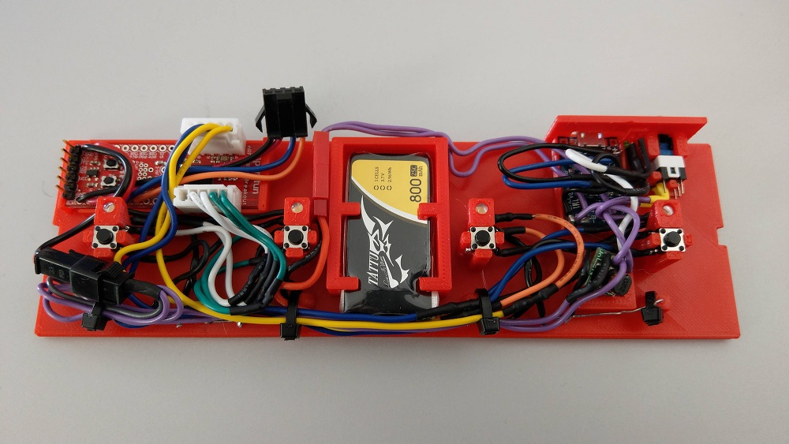

# Final Assembly

#### WARNING: As of the time of this writing, the 3D model doesn't leave enough room for the expresswion pedal jacks, so all of the pictures below (until I redesign the 3D model) will not include the jacks.

If you have followed all of the instructions found on the [main page](), then you are ready to assemble the final unit.  If using the [3D printed]() chassis/case, be patient, and try not to force things, as some of the more detailed areas of the print can be quite brittle (especially if printed with PLA).

Some of the pictures you will see below will be a little different than what was described in the instructions, as these pictures were taken while I was prototyping, so the pictures might be a bit off.  When I build my next unit (probably after a re-design of the 3D model), I will take pictures more frequently along the way.  For now, these are close enough, and after following the instructions below, your final assembled unit should look like this...

- External

  

- Back of Unit

  

- Internal

  

## Instructions

1. Insert the LiPo battery into the case (do this first, as the wires of components will make this more difficult as they are added)

2. Insert the power circuit components into the case in the following order.

   - Power regulator board
     - Slide into the mount/slot

   - Charging board
     - Insert into the back of the case, and then push down until it clicks.  Make sure the USB port is exposed through the hole in the back.

   - Charging LED (use a dab of hot glue to secure)
     - Push the green charging LED through the bottom mounting hole on the back of the case.

   - Power LED (use a dab of hot glue to secure)
     - Push the red power LED through the bottom mounting hole on the back of the case.

   - Power switch & cap
     - Place the cap in the slot at the back of the case, with the slot side up.
     - Put the power switch in the holder so that it slides into the cap's slot.
     - Push down until the back of the switch clicks into the holder

   - Add a blob of hot glue to all components (except the power switch cap) to prevent vibrations from jarring them loose.

3. Insert the button assemblies into the chassis/case working your way from the right-most (fourth) unit to the left-most (first).

   - Button LED
     - Gently bend the legs of the LED to a 90 degree angle
     - Insert the LED into the LED mounting hole toward the back edge

   - Button Switch (tactile)
     - Gently insert the tactile switch from the top into the holder, until it clicks into all four corners.
     - Make sure pins 3, and 4 are facing the front edge of the case

   - Add a blob of hot glue to the LEDs to prevent vibrations from jarring them loose.

4. Install the expression pedal jacks into the back face of the chassis/case

   - If you are not installing expression pedal jacks, remove or comment out the two addExpressionPedal() lines in [midi-ble-footswitch.ino](../midi-ble-footswitch.ino), OR make a male connector that just jumps pin 1, 3, and 5 together.

   - The reason for this complication is that the current 3D model design does not leave enough room to install the two 1/4" jacks.  This will be fixed in a future revision, then these instructions can be made simpler around the expression pedal jacks.

5. Insert the microcontroller board into the chassis/case

   - You probably want to have the unit programmed at this point to make things easier

   - Remember to disconnect the LiPo battery before attempting to program the microcontroller.

   - Insert the microcontroller board into the slot located at the back left corner.  Install by sliding the right side (non-header-pin side) into the slot on the right, and then pressing the left side down until it clicks.

   - Add a blob of hot glue to the left side of the board to ensure it stays in place.  (although the clips should be strong enough to hold on their own)

6. Connect all connectors in the following order

   - Connect the 2 pin male and female power connectors together (not the red LiPo battery connectors yet)

   - Connect the 2 sets of 5 pin male and female connectors for the button circuits together

   - Connect the 4 pin male and female expression pedal jack connectors together

   - Connect the LiPo battery to the main JST power connector.

7. Test out the unit now to make sure everything appears to be working.

   - Connect a charger via a micro-USB cable plugged into the back of the unit.  You should see the green LED light up to signify it is charging (it will not light if the battery it already fully charged)

   - Disconnect the USB cable once you have verified the charging LED works.

   - Turn on the unit with the power switch at the back

   - The red power LED should light at the back of the unit

   - On power up, the button LEDs should light in the following sequence as a sort of self-test.

     - Lights all LEDs from left to right

     - Lights all LEDs from right back to left

     - Flashes all LEDs twice

   - Once the self-test sequence is complete, the unit should enter pairing mode.  In pairing mode the device will alternate lighting every other button LED.

  - Use your BLE MIDI compatible device to find and pair to this footswitch.

    - When a connection is established, the button LEDs should turn off.

  - While connected via BLE, press each button switch to make sure the corresponding LED lights up appropriately.

  - If you have expression pedals, connect them now and test them with your BLE MIDI compatible device.

  - If everything checks out ok, power the unit down, and move onto the next step, otherwise, have fun troubleshooting!

8. Organize wires

   - Route all wires possible along the front side of the unit, leaving any excess on the left side of the board (near the main microcontroller board)

   - Insert 4 zip ties into the zip tie rings located toward the front side of the case.  (be sure to wrap around all wires)

   - Pull the zip ties tight, flatting the wire into a nice bunch as you go

9. Re-test the unit to make sure securing the wires didn't break any connections

10. Assemble the chassis/case

    - Hold the top of the 3D printed case face down in your hand

    - Place the button inserts into the round slots, ensuring the tab is in the slot close to the back edge of the unit

    - Place the bottom (with all of the circuitry) into the top, making sure that the panel at the back fits into the groove of the top.

      - The two pieces should slide easily into each other until it's time to snap them together.

    - Snap the two halves together one corner at a time until the bottm panel sits flush with the bottom edge of the top half.

    - Attach rubber feet in each of the four corners

11. Enjoy!!!

## Using the Footswitch

Get to know your footswitch by reading the [instruction manual](instruction-manual.md).

