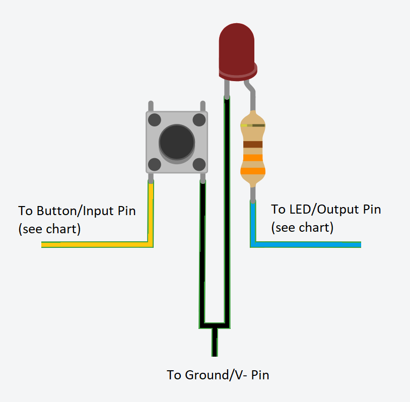
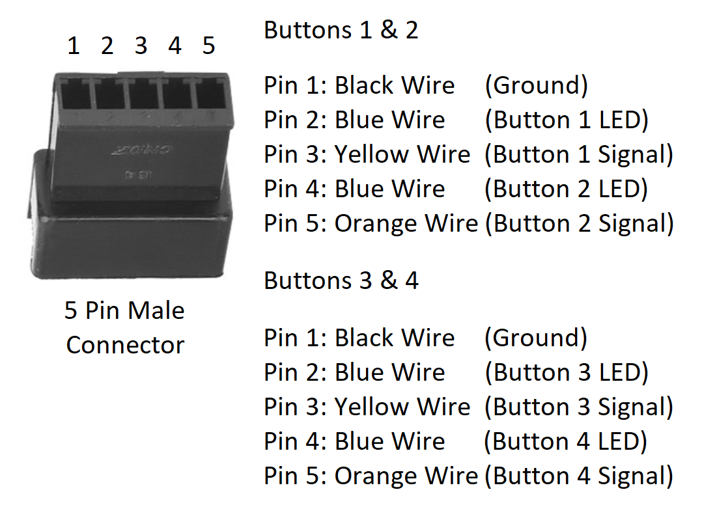

# Soldering the Button Circuit

## Parts

Each button pair will need the following components to be soldered together.

- 1 x 5 pin male connector (for each pair of buttons)
- 2 x LEDs (white)
- 2 x tactile switches
- 2 x 330 ohm resistors
- 8 pieces of 24 gauge wire (match colors to connector counterpart from other instruction pages - recommended colors below)
  - 4 black (for all ground/V- connections)
  - 2 blue
  - 1 yellow
  - 1 orange
- Heat-shrink tubing
- _Before you start, dry-fit all button/LED pairs, and cut the 8 wires so that they reach where the sparkfun board will be in the chassis/case._

## Instructions

The circuit for each individual button is fairly simple, and should be wired as shown here.  (remember that we are building these in pairs, so two of these will be hooked up to each 5 pin connector)

Repeat the instructions below for each button pair.  (4 buttons / 2 pairs in the default configuration)

### Solder the LED/Resistor

  1. Snip the long leg (anode/+) of the LED to a few millimeters in length

  2. Snip the legs of a 330 own resistor to a few millimeters in length

  3. Solder one leg of the resistor to the LED leg we cut short in the previous step.

  4. Solder a blue wire to the other leg of the resistor.

  5. Snip the remaining leg of the LED to a length of a few millimeters

  6. Solder a black wire to the LED leg

  7. Apply two lengths of heat-shrink tubing ... enough to cover from the base of the LED to 3-4mm past the exposed soldered wire.  (including over the resistor)

  8. Repeat the above steps for the second LED in the pair.

### Solder the tactile switch

  1. Solder a black wire to pin 4 of the tactile switch

  2. Solder a yellow (orange for the 2nd button in the pair) wire to pin 3 of the tactile switch

  3. Apply two lengths of heat-shrink tubing ... enough to cover the soldered posts to 3-4mm past the exposed soldered wire.

  4. Repeat the above steps for the second tactile switch in the pair.

### Connect wires to the 5-pin (male) connector

  1. Dry fit the two LEDs and two tactile switches into the chassis/case.  (you'll probably have to bend the LED's legs to a 90 degree angle to fit them in easily)

  2. Group all of the wires together, and line them up to where the sparkfun board is inside the chassis/case.  Cut all wires where the shortest wire ends.

  3. Connect each wire to the connector as shown in the following diagram...

     

#### See the [soldering the microcontroller](howto-solder-microcontroller-board.md) page for information about the matching female connector, and what it hooks up to.

