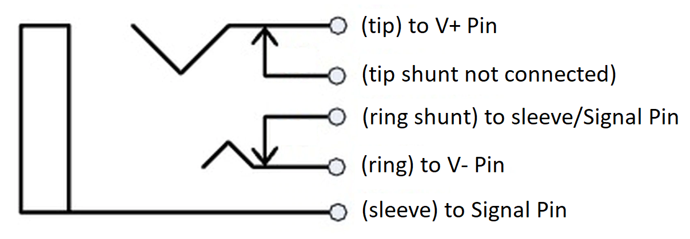
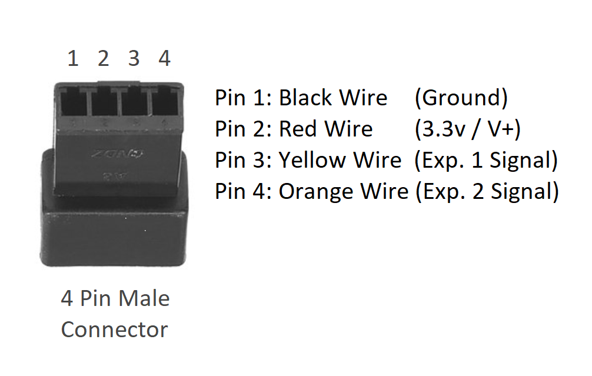

# Soldering the Expression Pedal Jacks

## Parts

Each pair of jacks need the following components to be soldered together.

- 1 x 4 pin male connector (for each pair of jacks)
- 2 x 1/4" stereo jacks with ring shunt (one per expression pedal port)
- 8 pieces of 24 gauge wire
  - 2 black
  - 2 black (SHORT - just long enough to jump across the two contacts on the jack - see below)
  - 2 red
  - 1 yellow
  - 1 orange
  - _Before you start, dry-fit the jacks, and cut the 6 wires so that they will reach the sparkfun board will be in the chassis/case.  (the other two wires just need to be long enough to go from the shunt pin to the signal pin )_

## Instructions

The connection of the expression pedal jacks is fairly straight-forward.  It basically requires wiring +v to the tip, -v/gnd to the ring, and the signal wire to the sleeve.  The only tricky part is that the shunt should be soldered with the sleeve/signal as well so that the software can accurately detect that no expression pedal is connected (to prevent it from reporting a pedal position, which could cause it to report as position zero/off for volume for example ... causing much grief).  The wiring of the jack should match the diagram shown here.  (remember that we are building these in pairs, so two of these will be hooked up to each 4 pin connector)

Repeat the instructions below for each expression pedal jack pair.  (2 jacks / 1 pair in the default configuration)

### Solder the Jacks

  1. Solder a regular length black wire, and a short black wire to the sleeve pin of the 1/4" jack.

  2. Solder the other end of the short black wire to the ring shunt pin of the 1/4" jack.
     - (this will ensure that if an expression pedal is not connected, no position changes will be reported --- this will prevent a volume, or effect being set to OFF when nothing is plugged into the jack)

  3. Solder a red wire to the tip pin of the 1/4" jack.

  4. Solder a yellow (orange for the 2nd jack) wire to the ring pin of the 1/4" jack.

  5. Repeat the above steps for the second expression pedal jack in the pair.

### Connect wires to the 4-pin (male) connector

  1. Dry fit the 1/4" stereo jacks in the chassis/case.

  2. Group all of the wires together, and line them up to where the sparkfun board is inside the chassis/case.  Cut all wires where the shortest wire ends.

  3. Connect each wire to the connector as shown in the following diagram...

     

     - Pin 1 connected to the TWO black wires that lead to the ring pins of each jack.

     - Pin 2 connected to the TWO red wires that lead to the tip pins of each jack.

     - Pin 3 to the yellow wire that leads to the sleeve pin of the jack for expression pedal 1.

     - Pin 4 to the orange wire that leads to the sleeve pin of the jack for expression pedal 2.

#### See the [soldering the microcontroller](howto-solder-microcontroller-board.md) page for information about the matching female connector, and what it hooks up to.

