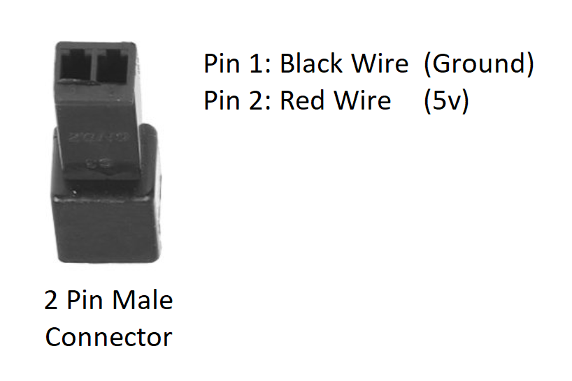
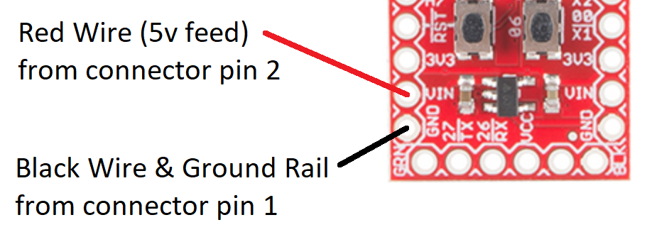
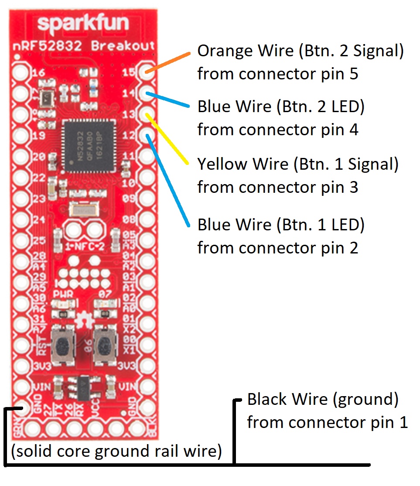
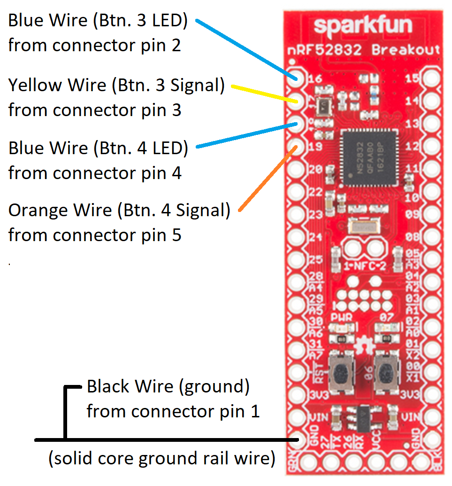
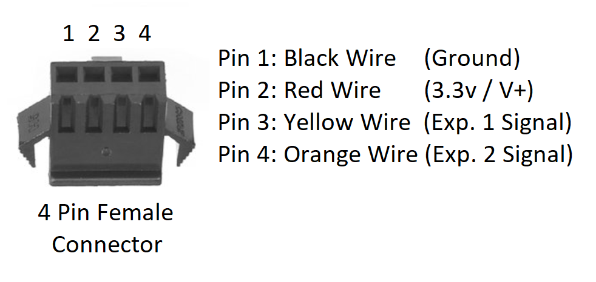
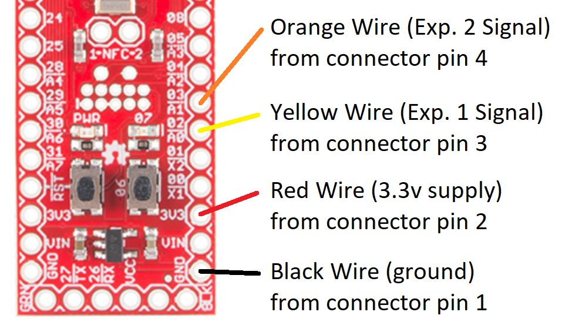

# Soldering the Microcontroller Connectors

## Parts

The parts needed here all of the connectors needed so that the board can easily be connected/disconnected.

- 1 x 2-conductor male connector (for power)
- 2 x 5-conductor female connectors (one for each pair of buttons)
- 1 x 4-conductor female connector (for the two expression pedal jacks)
- 17 pieces of 24 gauge wire cut to 2"-3" each (match colors to connector counterpart from other instruction pages - recommended colors below)
  - 4 black (for all ground/V- connections)
  - 2 red
  - 3 yellow
  - 3 orange
  - 4 blue (for the 4 button LEDs)
- 1 piece of SOLID CORE wire, fully stripped (for use as a ground rail for all of these connectors' ground point)

## Instructions

The microcontroller board just needs all of the various connectors attached for easy connect/disconnect.

In the end, the board should look something like this...

_PLEASE NOTE: The above pictures show slightly different connectors than the ones listed on the [parts list](parts-list.md) page.  The general idea is exactly the same._

_BEFORE YOU PROCEED: If you haven't already done so, you probably want to solder the serial header pins as described on [this page](updating-the-microcontroller.md#Programming%20the%20Microcontroller%20Board) now.  You will need that to program the microcontroller board._

### Power Connector and "Ground Rail"

- Connect a black wire and a red wire to the 2-pin male connector as shown in the following diagram...

  

- On the BLE breakout board (in the bottom left corner), solder the black wire, and the solid core (ground rail) wire to the contact labeled `GND`, and the red wire to the contact beside it labeled `VIN`.

  

### Connector for Buttons 1 & 2

- Connect the following wires to the 5-pin female connector, and BLE board as shown in this chart (more details and pictures can be found below that).

  | Connector Pin | Wire Color  | Purpose               | BLE Board Contact/Pin |
  |---------------|-------------|-----------------------|-----------------------|
  | 1             | Black       | Ground / V-           | (ground rail)         |
  | 2             | Blue        | Button 1 LED          | 12                    |
  | 3             | Yellow      | Button 1 Input Signal | 13                    |
  | 4             | Blue        | Button 2 LED          | 14                    |
  | 5             | Orange      | Button 2 Input Signal | 15                    |

- Connect the wires (by color as shown in the chart above) to the 5-pin female connector as shown in the following diagram...

  

- Solder the wires (by color as shown in the chart above) to the appropriate board contacts/pins.

  - Solder the black wire to any open area on the ground rail (bare solid core wire).

  - Solder the blue wire (attached to pin 2 on the connector) to the BLE board contact/pin `12`

  - Solder the yellow wire to the BLE board contact/pin `13`

  - Solder the other blue wire (attached to pin 4 on the connector) to the BLE board contact/pin `14`

  - Solder the yellow wire to the BLE board contact/pin `15`

  

### Connector for Buttons 1 & 2

- Connect the following wires to the 5-pin female connector, and BLE board as shown in this chart (more details and pictures can be found below that).

  | Connector Pin | Wire Color  | Purpose               | BLE Board Contact/Pin |
  |---------------|-------------|-----------------------|-----------------------|
  | 1             | Black       | Ground / V-           | (ground rail)         |
  | 2             | Blue        | Button 3 LED          | 16                    |
  | 3             | Yellow      | Button 3 Input Signal | 17                    |
  | 4             | Blue        | Button 4 LED          | 18                    |
  | 5             | Orange      | Button 4 Input Signal | 19                    |

- Connect the wires (by color as shown in the chart above) to the 5-pin female connector as shown in the following diagram...

  

- Solder the wires (by color as shown in the chart above) to the appropriate board contacts/pins.

  - Solder the black wire to any open area on the ground rail (bare solid core wire).

  - Solder the blue wire (attached to pin 2 on the connector) to the BLE board contact/pin `16`

  - Solder the yellow wire to the BLE board contact/pin `17`

  - Solder the other blue wire (attached to pin 4 on the connector) to the BLE board contact/pin `18`

  - Solder the yellow wire to the BLE board contact/pin `19`

  

### Connector for Expression Pedal Ports 1 & 2

- Connect the following wires to the 4-pin female connector, and BLE board as shown in this chart (more details and pictures can be found below that).

  | Connector Pin | Wire Color  | Purpose                   | BLE Board Contact/Pin |
  |---------------|-------------|---------------------------|-----------------------|
  | 1             | Black       | Ground / V-               | GND                   |
  | 2             | Red         | 3.3v / V+                 | 3V3                   |
  | 3             | Yellow      | Expression Pedal 1 Signal | 02                    |
  | 5             | Orange      | Expression Pedal 2 Signal | 03                    |

- Connect the wires (by color as shown in the chart above) to the 4-pin female connector as shown in the following diagram...

  

- Solder the wires (by color as shown in the chart above) to the appropriate board contacts/pins.

  - Solder the black wire to the BLE board contact/pin `GND` (in the bottom right corner)

  - Solder the red wire to the BLE board contact/pin `3V3` (in the bottom right corner)

  - Solder the yellow wire to the BLE board contact/pin `02`

  - Solder the orange wire to the BLE board contact/pin `03`

  

