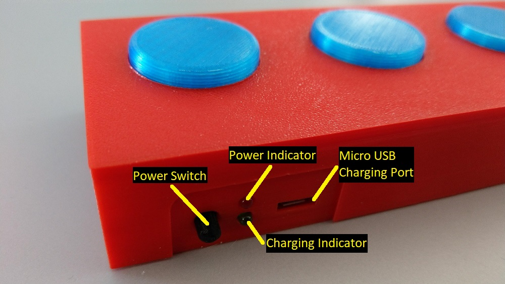
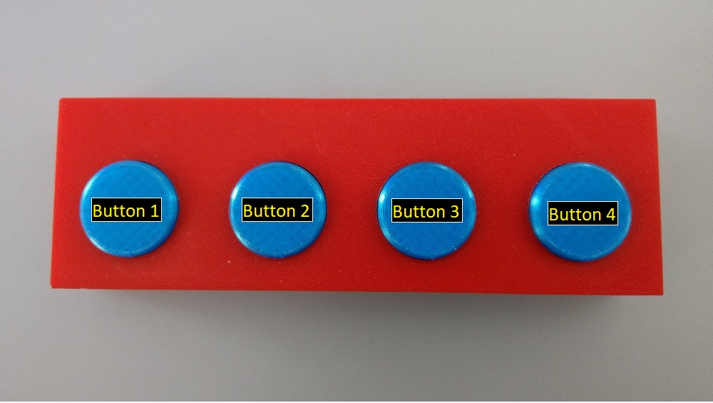

# Instruction Manual / Using Your Wireless MIDI Footswitch System

The instructions here are assuming that you used the software as it comes out of the box, and without any customizations whatsoever.  If you have customized things, then you will need to adjust these instructions accordingly for the cofiguration you ended up with.

## Rear / Power Panel

| Part               | Description |
|--------------------|-------------|
| Power Switch       | Pressing the power switch inward until it clicks will turn the unit on and off alternately with each press. |
| Power Indicator    | Indicator will light RED when the unit is powered on.  If the indicator light, then the battery needs to be charged. |
| Charging Indicator | When a Micro USB cable it connected to the charging port, this indicator will light up green whuke the battery is charging, and will turn off once the battery is fully charged. |
| Charging Port      | Connect a Micro USB charger to this port to charge the battery.  The battery can be charged while using unit, as well as powered off, as long as there is a charger connected. |

## Powering On / Bootup Self-Test Sequence

1. Turn on the unit by pressing the power switch on the back panel.  (press it utnil it clicks)

2. Upon starting up, the unit should display a self-test animation sequence with the LED buttons.  The sequence should be as follows...

   - Lights all LEDs from left to right

   - Lights all LEDs back from right to left

   - Flashes all LEDs twice

3. Once the self-test animation sequence is complete, the unit should enter pairing mode.

## Pairing Mode

This unit will automatically enter pairing mode when there are no bluetooth devices connected to it.  Pairing mode is indicated by every other button light alternately being lit (1 and 3, then 2, and 4 for example).  This pattern is repeated for as long as there are no connected devices.

If a bluetooth connection is dropped, pairing mode will be engaged until a device reconnects.  (for units that have been customized to have latching footswitches, the latching status will be reset upon reconnect)

## Using the Footswitches

The four footswitches send basic MIDI control change commands when pressed.  The value of the controls will be sent as 127 when pressed, and 0 when let go.

| Button Number | Midi Channel | Midi Control Number |
|---------------|--------------|---------------------|
| 1             | 1            | 20                  |
| 2             | 1            | 21                  |
| 3             | 1            | 22                  |
| 4             | 1            | 23                  |

## Using Expression Pedals

_TODO: Ok, ok, so I don't have any pictures for this yet.  For now, use your imagination, until I print and build the next revision._

Connecting an expression pedal to either of the expression pedal jacks will cause the signal to be read, and reported to the MIDI device as a number from 0-127 to signify its position.

| Pedal/Port Number | Midi Channel | Midi Control Number | Control Type |
|---------------|-------------|---------------------|---|
| 1             | 1           | 12 | effect control 1                 |
| 2             | 2           | 13 | effect control 2                 |

Any pedals connected to these jacks should not be removed while the unit is on, as it will cause the unit to think the pedal is now fully in the back/off position.  If you need to disconnect a pedal from these ports, either power off/on the unit, or ensure that the device you are controlling is set to ignore the pedal position.

## Internal Battery

Inside the footswitch case, there is an 8000maH LiPo battery, which should easily last a MINIMUM of 8 hours on a single charge.  That time was calculated using a worst case scenario of all LEDs constantly being lit, and the expression pedals constantly moving back and forth, so, in reality, it really should last many multiples of time longer than the 8 hours, but I didn't want to put a false claim in here, so 8 hours it is.

Unfortunately, this footswitch does not currently have a low battery indicator, so you should charge the unit after every 8 hours of use to ensure it won't let you down during use.

(a future revision will most likely include a low battery indicator and circuit, nbut for now, just charge it up every now and then)

## Troubleshooting

| Problem / Symptom | Solution |
|-------------------|----------|
| No bootup sequence when turned on. | Charge the battery |
| Devices cannot detect the BLE pedal, or signal drops at a short distance away | Right now, this is a known issue with the 3D model.  The next revision will have gaps in the case so that the signal can penetrate more easily. |
| Button insert sticks when pressed | Lightly sand off any rough edges in the round hole, or on the edge of the button insert itself.  If that fails, try reducind the overall size of the insert by 1mm before printing. |
| Button press lights LED but my MIDI BLE compatible device does not respond | Ensure your MIDI BLE compatible device is set to respond to the proper control numbers (and values of 0 or 127). |
| Expression pedal is plugged in, but my MIDI BLE compatible device does not respond | Ensure your MIDI BLE compatible device is set to respond to the proper control numbers |

## Known Issues

- No low battery indicator --- charge the unit every so often.  (it has plenty of battery life, but after every 8 hours of use, the unit should be charged)
- The signal does not currently penetrate the 3D printed case very well.  The next revision of the case will have gaps built in so as to let the signal penetrate more easily.

