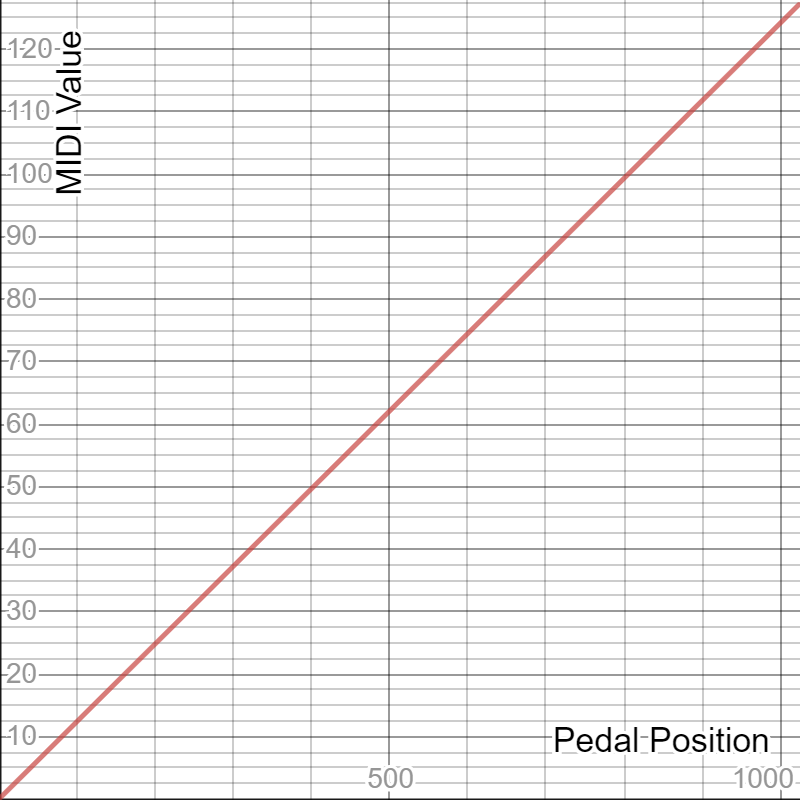
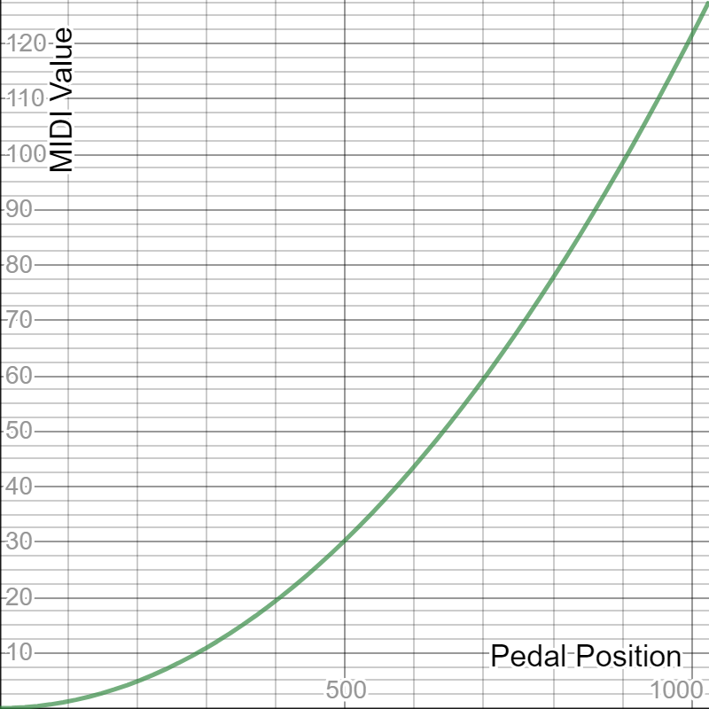
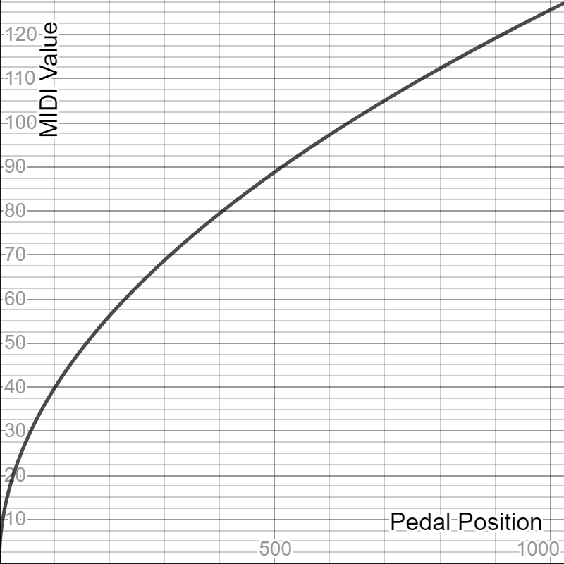
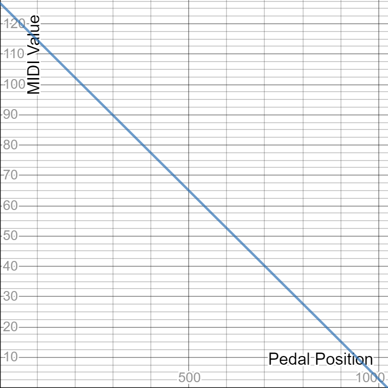
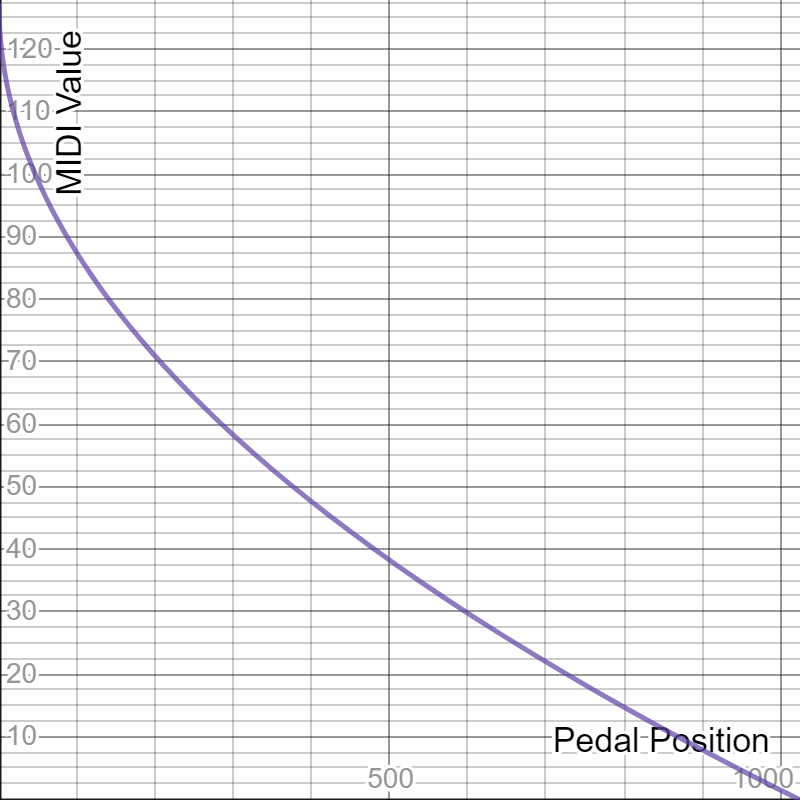

# TODO/WIP: Pedal Curve Type Reference Chart

#### Direction & Curve Types Constants

| Curve Type                         | Direction                              | Curve Shape                                    |
|:-----------------------------------|:--------------------------------------|:------------------------------------------------|
| EXPRESSION_PEDAL_CURVE_LINEAR      | EXPRESSION_PEDAL_DIRECTION_LOW_TO_HIGH |        |
| EXPRESSION_PEDAL_CURVE_ACCELERATED | EXPRESSION_PEDAL_DIRECTION_LOW_TO_HIGH |   |
| EXPRESSION_PEDAL_CURVE_DECELERATED | EXPRESSION_PEDAL_DIRECTION_LOW_TO_HIGH |   |
| EXPRESSION_PEDAL_CURVE_LINEAR      | EXPRESSION_PEDAL_DIRECTION_HIGH_TO_LOW |       |
| EXPRESSION_PEDAL_CURVE_ACCELERATED | EXPRESSION_PEDAL_DIRECTION_HIGH_TO_LOW |  |
| EXPRESSION_PEDAL_CURVE_DECELERATED | EXPRESSION_PEDAL_DIRECTION_HIGH_TO_LOW |  |
