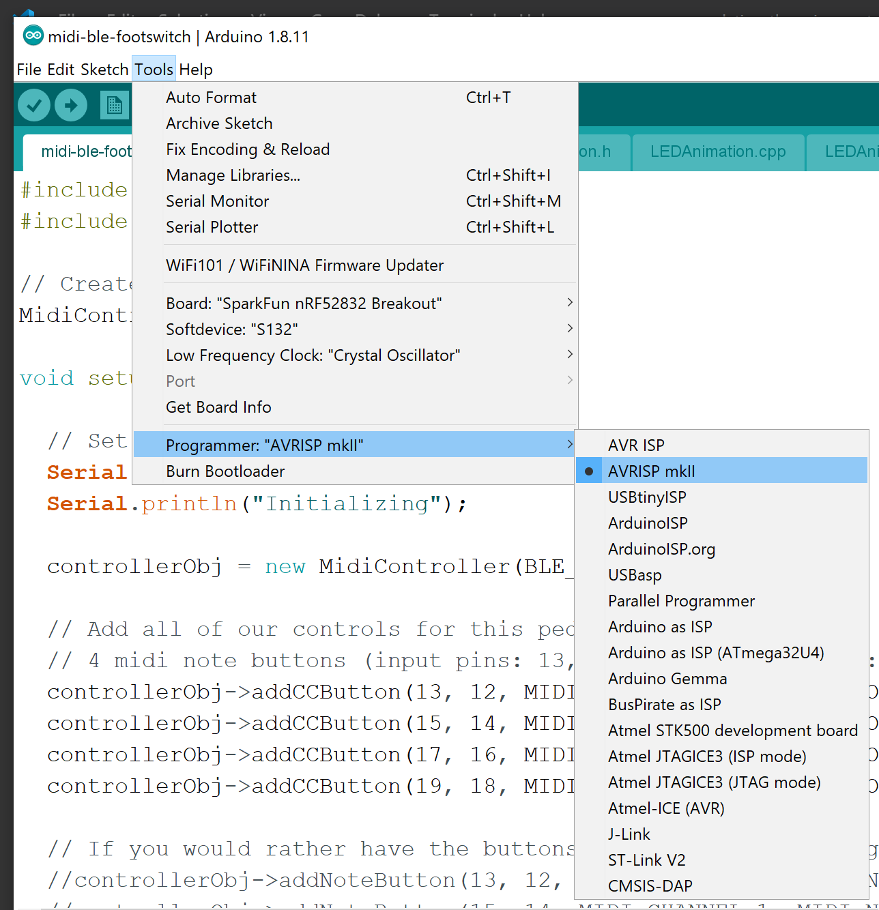

# Updating the Microcontroller Board

This page will get you up and running with the Arduino IDE, and getting your board programmed, and configured.

## Setting up the Arduino IDE

Follow these instructions to get the arduino IDE setup to be able to compile the software for use on the Sparkfun BLE Breakout Board.

- Download the Arduino IDE [here](https://www.arduino.cc/en/main/software)
- Open the Arduino IDE
- Add the sparkfun repository
  - Click `File` -> `Preferences`
  - Under `Additional Board Manager URLs`, enter
    `https://raw.githubusercontent.com/sparkfun/Arduino_Boards/nrf5/IDE_Board_Manager/package_sparkfun_index.json`
    
  - Click `OK`
- Install the sparkfun driver
  - Click `Tools` -> `Board` -> `Boards Manager`
  - In the search box, enter `SparkFun nRF52 Boards`.
  - Select that item, and click `INSTALL`
    
  - BE PATIENT!  This takes a while, and will look like it's not doing
    anything for a while.  It took several minutes for me.
- Select the Sparkfun Board in the IDE
  - Click `Tools` -> `Board`
  - Select `"SparkFun nRF52832 Breakout"` under the `"Nordic Semiconductor nRF5 Boards"` section.
    
- Clone the software github
  - Drop down to a terminal or command prompt
  - Navigate to where you would like the software to be on your computer.
(for example c:\\source or ~/source)
  - `git clone git@github.com:danny6869/midi-ble-footswitch.git`
- Open the Folder in the Arduino IDE
  - Open the Arduino IDE
  - Click `File` -> `Open`
  - Navigate to the directory/folder where you cloned the project above
  (`c:\\source\\midi-ble-footswitch` or `~/source/midi-ble-footswitch`) and click `OPEN`
  - The code should now be visible in the IDE.
- Test to make sure everything is setup properly
  - In the Arduino IDE, click `Sketch` -> `Verify/Compile` (or hit `CTRL-R`)
  - You should see the bottom black window have a title of `"Compiling Sketch"`, and a progress bar on the right.
  - Once that is complete, if everything worked ok, the last line you should see is something similar to the following

    `Sketch uses 23628 bytes (5%) of program storage space. Maximum is 409600 bytes.`

  - If you do not see the above line, re-execute all of the steps in this section.  (without this working, you will not be able to properly program the board)

## Customizing the Code

At this point you can [configure your device](software-configuration.md) or customize the code, but when first getting things going, it's recommended that you stick with the default configuration, but with one minor change.

Un-comment the following line in the main [midi-ble-footswitch.ino](../midi-ble-footswitch.ino) file...

`controllerObj->addCCButton(6, 7, MIDI_CHANNEL_1, MIDI_CC_CONTROL_20);`

That will allow the on-board button, and LED to work as a midi button ahead of putting together all of the hardware.

## Programming the Microcontroller Board

1. Solder a 6 pin header strip onto the 6 debug pins found on the bottom
edge of the sparkfun board
   - 

2. If using the Gikfun programming board listed above, you will need to solder a 1 pin header to the terminal labeled 3.3v (as the sparkfun board needs 3.3v while programming)

3. Use the 6 female-female jumper wires to match up the pins from USB to TTL programmer.  Basically the pin labels should all match, except the TX pin should be linked to the RX pin on the other board, and vice-versa.  Also, beware that the programming voltage of the sparkfun board is 3.3v, so we will not be connecting to the VCC pin on the programming board, but to the 3.3v pin we soldered onto it in the previous step.
   - 

4. Plug the programming board into your computer using a USB cable (mini usb in the case of the Gikfun programming board)
   - (if you are programming a fully assembled unit, be sure to disconnect the LiPo battery)

5. Configure the Programming Board in the Arduino IDE
   - Open the Arduino IDE
   - Click `Tools` -> `Port` and select the COM port of the programmer board (most likely the only COM port listed)
   - Click `Tools` -> `Programmer`
   - Select `"AVRISP mkII"`
   - 

6. Get the Sparkfun BLE Board in bootloader/programming mode
   - Press and hold the pin 6 button
   - Press and release the reset button
   - Within a second or two you should see the onboard blue LED light flash a sequence of long to short flashes.  If you see this, you are in programming mode, and the device is ready to be flashed, and you can release the pin 6 button.
   - _If you DO NOT see that LED flashing sequence, there is probably some sort of interference, or static happening.  IT TOOK ME FOREVER TO REALIZE THAT MY FINGERS WERE CAUSING THE ISSUE.  FIGURING OUT THAT THIS WAS THE ISSUE FOR ME WAS THE SINGLE MOST FRUSTRATING PART OF THIS PROJECT.  BE PATIENT, AND FOLLOW THESE TIPS CAREFULLY TO SAVE YOURSELF FRUSTRATION!_
     - Put the board(s) on non-conducting static-free surface, like a table.
     - Use two toothpicks (or anything small and non-conductive) to press the Pin 6/Reset buttons.
   - For more information about getting started with the Sparkfun BLE Board, see the [Official Sparkfun BLE Breakout Board Hookup Guide](https://learn.sparkfun.com/tutorials/nrf52832-breakout-board-hookup-guide?_ga=2.235217601.1522060654.1581984917-256708523.1575427305)

7. Flash the Sparkfun Board
   - Open the Arduino IDE
   - Open the midi-ble-footswitch code
   - Click `Sketch` -> `Upload` (or `CTRL-U`)

## Testing / Debugging

WARNING: Before continuing...If you are testing or debugging a fully assembled footswitch unit, you MUST unplug the LiPo battery.

- Open the Arduino IDE
- Click `Tools` -> `Serial Monitor`
- In the window that pops up, ensure your communication settings in the bottom right corner are set properly for your programmer device (115200, 8, N, 1)
- Connect the sparkfun board to your compunter using a USB cable
  - Follow steps 3, 4, and 5 above
- Once the unit boots (after a few seconds) you should start seeing debug output from the Sparkfun board in the serial monitor window.

